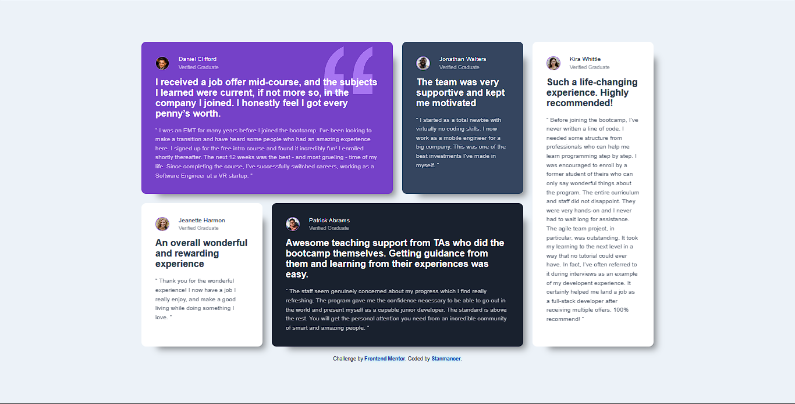

# Frontend Mentor - Testimonials grid section solution

This is a solution to the
[Testimonials grid section challenge on Frontend Mentor](https://www.frontendmentor.io/challenges/testimonials-grid-section-Nnw6J7Un7).
Frontend Mentor challenges help you improve your coding skills by building
realistic projects.

## Table of contents

- [Overview](#overview)
  - [The challenge](#the-challenge)
  - [Screenshot](#screenshot)
  - [Links](#links)
- [My process](#my-process)
  - [Built with](#built-with)
  - [What I learned](#what-i-learned)
  - [Continued development](#continued-development)
  - [Useful resources](#useful-resources)
- [Author](#author)

## Overview

### The challenge

Users should be able to:

- View the optimal layout for the site depending on their device's screen size

### Screenshot

### Links

- Solution URL: [solution here](https://your-solution-url.com)
- Live Site URL:
  [live site here](https://stanmancer.github.io/testimonials-grid-section/)

## My process

### Built with

- HTML5
- CSS custom properties
- Flexbox
- CSS Grid

### What I learned

- Using fonts directly from [Google fonts](fonts.google.com)
- gained more exposure with css grids, box shadows and hover animations

### Continued development

- css grids
- css animations
- semantic html5 markup

### Useful resources

- [CSS grid crash course | Traversy Media](https://www.youtube.com/watch?v=0xMQfnTU6oo&t=2992s) -
  This helped me learn css grids. It was easy to understand and even had
  practical examples.
- [Google fonts CSS API update](https://developers.google.com/fonts/docs/css2) -
  This is an amazing article which helped me understand how to use google fonts
  css api. I'd recommend it to anyone learning this concept.

## Author

- Website - [Stanmancer](https://limey.io/stanmancer)
- Frontend Mentor -
  [@stanmancer](https://www.frontendmentor.io/profile/stanmancer)
- Twitter - [@stanmancer](https://www.twitter.com/stanmancer)
